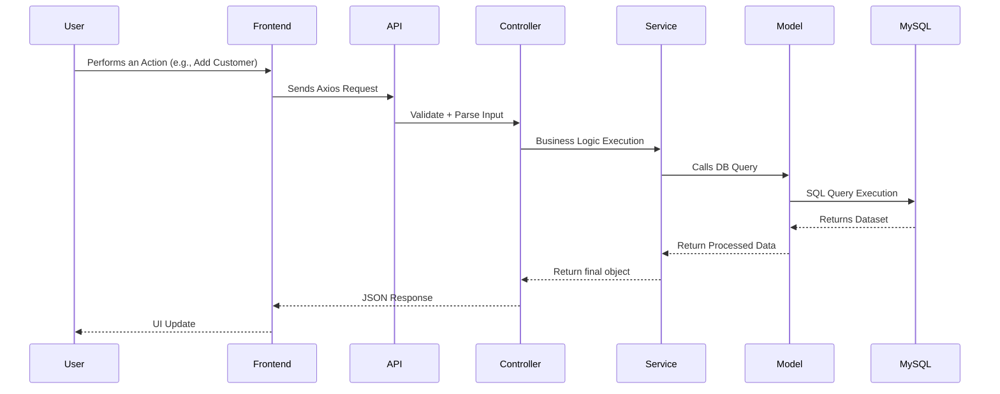
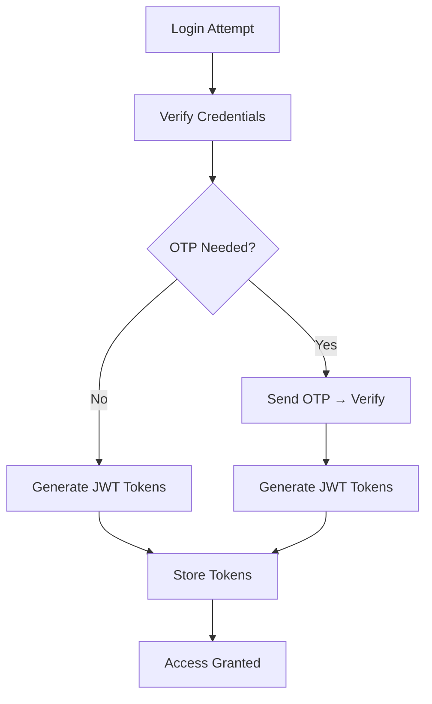

# 🚜 **Laxmi Jee Rice Mills**

### **Public Web Portal & Admin Dashboard**

A production-ready, full-stack monorepo powering the entire digital workflow of **Laxmi Jee Rice Mills**, including:

🌐 **Public Web Portal** — customer-facing
🛠️ **Admin Dashboard** — internal business management
🗄️ **REST API Backend** — Node.js + Express
💾 **MySQL Database Layer** — relational and optimized

This platform uses a modern **layered architecture**, delivering clean code structure, high performance, strong security, and a professional UI/UX experience.

---

# 🏷️ **Tech Stack Badges**

<p>


</p>

---

# ⭐ **Highlights at a Glance**

* Fully scalable **monorepo architecture**
* Production backend with **industry-standard layered structure**
* Modern UI engineered with **React + Vite**
* Secure authentication: **JWT, OTP, encrypted passwords**
* Fully mobile-responsive **Admin Dashboard**
* Completely optimized **Public Website with mega menu**
* Clean folder-level separation for **API, Services, Controllers, Models**
* Configurable environment for **local & cloud deployment**

---

# 🌟 **Top Features**

## 🌐 Public Web Portal

* Stunning animations & layout
* All styles handled through internal `<style>` block
* Auto dark mode using `useDarkMode` hook
* Ultra responsive sticky header
* Mega categories listing with multi-column layout
* SEO-optimized structure

## 🛠️ Admin Dashboard

* Modular react architecture
* Full CRUD operations (Customers, Orders, Categories, Products, Users)
* Advanced form validations
* Charts & analytics ready structure
* Reusable UI components
* AuthContext for global state management
* API abstraction layer (`/src/api`)

## 🔒 Backend & Security

* JWT with Access + Refresh tokens
* Optional OTP with expiry validation
* Input sanitization on every route
* SQL Injection protected via prepared statements
* Centralized error handling middleware
* Rate limiting (optional)

---

# 🏗️ **System Architecture**

## **High-Level Architecture Diagram**

```
┌──────────────────┐        ┌────────────────────┐        ┌─────────────────┐
│    React Frontend │ -----> │   Express Backend   │ -----> │     MySQL       │
└──────────────────┘        └────────────────────┘        └─────────────────┘
          ↑                            ↑                              
          │                            │
          └──────── API Client (Axios) ┘
```

---

# 🔁 **Full Request Lifecycle (Data Flow)**



---

# 🧬 **Authentication Workflow**

✔ JWT Login
✔ OTP Login
✔ Token Refresh
✔ Role-based access



---

# 🗄️ **Database ER Diagram (Simplified)**

```
Customers
    ├── id (PK)
    ├── name
    ├── mobile
    └── address

Orders
    ├── id (PK)
    ├── customer_id (FK)
    ├── product_id (FK)
    └── quantity

Products
    ├── id (PK)
    ├── name
    ├── category_id (FK)
    └── price

Categories
    ├── id (PK)
    └── name

Users
    ├── id (PK)
    ├── username
    ├── password
    └── role
```

---

# 🛡️ **Backend Security Features**

| Security Layer          | Description                                    |
| ----------------------- | ---------------------------------------------- |
| JWT Tokens              | Access + Refresh tokens for secure sessions    |
| OTP                     | Optional multi-factor verification             |
| SQL Injection Protected | Uses prepared statements everywhere            |
| Sanitization            | All inputs are sanitized                       |
| Error Handling          | Centralized to prevent information leaks       |
| Rate Limiting           | Optional throttling for brute-force prevention |

---

# 📦 **Environment Variables**

| Variable             | Description                   |
| -------------------- | ----------------------------- |
| `DB_HOST`            | MySQL host                    |
| `DB_USER`            | Database username             |
| `DB_PASSWORD`        | Database password             |
| `DB_NAME`            | Database name                 |
| `JWT_SECRET`         | Secret for signing JWT tokens |
| `OTP_EXPIRY_MINUTES` | OTP validity duration         |

---

# 📂 **Full Project Structure**

Already provided above, but expanded with config:

```
backend/
 ├── src/
 │    ├── controllers/
 │    ├── services/
 │    ├── models/
 │    ├── routes/
 │    ├── middleware/
 │    └── utils/
 └── config/
```

---

# 🖼️ **Screenshots Showcase**

Add real screenshots here.

### 🌐 Public Website

``

### 🛠️ Admin Dashboard

``

---

# 🚀 **Deployment Architecture**

```
Frontend → Vercel CDN  
Backend → Node Server / VPS / Railway / Render  
Database → MySQL Server  
```

---

# 🔧 **Logging & Monitoring**

* Console logging (dev mode)
* Error logging middleware
* Optional integration for:

  * ElasticSearch
  * Graylog
  * Sentry
  * PM2 Monitoring

---

# 🔄 **CI/CD (Optional Pipeline)**

You can integrate:

✔ GitHub Actions
✔ Vercel Deploy Hooks
✔ PM2 Auto Restart
✔ MySQL backup automation

---

# 📅 **Future Roadmap**

* [ ] Add charts & analytics in dashboard
* [ ] Implement role-based UI restrictions
* [ ] Add sales reporting & export
* [ ] Add vendor module
* [ ] Add payment gateway integration
* [ ] Add WhatsApp OTP login
* [ ] Convert backend to TypeScript

---

# 🤝 **Contributing Guide**

We welcome contributors!

1. Fork repository
2. Create a feature branch
3. Commit with clean messages
4. Submit PR

---

# 🐛 **Reporting Issues**

Open an issue here:
👉 **[https://github.com/bijendrakumarpatel/admin-dashboard/issues](https://github.com/bijendrakumarpatel/admin-dashboard/issues)**

---

# 📞 **Contact**

👤 **Developer:** *Bijendra Kumar Patel*
📧 Email: *[your-email@example.com](mailto:your-email@example.com)*
🌐 GitHub: [https://github.com/bijendrakumarpatel](https://github.com/bijendrakumarpatel)

---

# 📄 **License**

Licensed under the **MIT License**.

---

# 🎉 **Thank You for Visiting This Project!**
